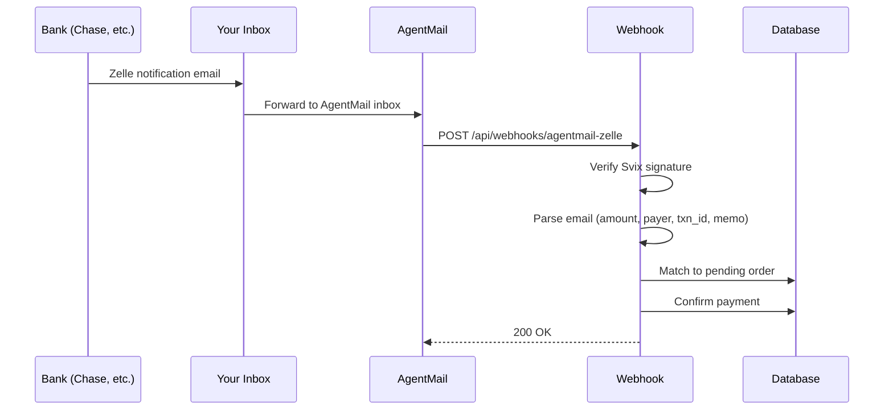

# Zelle Payment Verification via AgentMail

Automatic Zelle payment verification by parsing payment notification emails forwarded through AgentMail.

## How It Works



**Important**: Zelle doesn't send emails directly. Your bank (Chase, Bank of America, etc.) sends Zelle payment notifications on behalf of Zelle.

## Endpoint

```
POST /api/webhooks/agentmail-zelle
```

Located at: `server/api/webhooks/agentmail-zelle.post.ts`

## Configuration

### Environment Variables

```bash
# AgentMail webhook secret (Svix format)
AGENTMAIL_ZELLE_WEBHOOK_SECRET=whsec_...

# Fallbacks (shared secrets)
AGENTMAIL_WEBHOOK_SECRET=whsec_...
AGENTMAIL_WEBHOOK_SECRET_2=whsec_...
```

### AgentMail Setup

1. Create an inbox in AgentMail for Zelle notifications
2. Configure email forwarding from your Zelle-registered email to the AgentMail inbox
3. Set webhook URL: `https://www.peptidehackers.com/api/webhooks/agentmail-zelle`
4. Copy the Svix webhook secret to your environment

## Signature Verification

AgentMail uses Svix signatures (not a custom "Zelle-Signature"):

```
Headers:
- svix-id: msg_xxx
- svix-timestamp: 1234567890
- svix-signature: v1,base64signature
```

Verification: `HMAC-SHA256(secret, "{svix-id}.{svix-timestamp}.{body}")`

## Email Parsing

The webhook validates and parses Zelle notification emails:

### Sender Validation

Only accepts emails from:
- `no.reply.alerts@chase.com`

### Subject Patterns

Must contain one of:
- "zelle" (required for bank domain emails)
- "received"
- "sent you"
- "deposited"

### Chase Email Format

Chase sends Zelle notifications with an HTML table:

| Field | Example |
|-------|---------|
| Header | `SAMANTHA REMENY sent you money` |
| Amount | `$200.00` |
| Sent on | `Apr 02, 2026` |
| Transaction number | `28666646024` |
| Memo | `2961` |

### Data Extraction

Parses from email:
- **Amount**: From HTML table or `"you received $150.00"` pattern
- **Payer name**: From `"{NAME} sent you money"` header
- **Transaction ID**: From "Transaction number" table row
- **Memo/Note**: From "Memo" table row (used for order matching)

## Order Matching

A payment matches an order if **amount matches** AND **any one** of these is true:

| Criteria | Example |
|----------|---------|
| First name matches | Payer "SAMANTHA REMENY" matches order billing name "Samantha Jones" |
| Last name matches | Payer "JOHN SMITH" matches order billing name "Jane Smith" |
| Memo contains order ID | Memo "2961" matches order "PH-2961" |
| Order ID contains memo | Order "PH-2961" contains memo "2961" |

### Match Requirements

1. Payment method must be `zelle`
2. Order status must be `pending` / `awaiting_payment`
3. Amount >= order total (accepts overpayment)
4. One of the criteria above must match

### No Match

If none of the criteria match, the payment requires manual review.

## Response Codes

| Status | Meaning |
|--------|---------|
| `200 { ok: true }` | Processed successfully |
| `200 { ok: true, skipped: true }` | Not a Zelle payment email |
| `200 { ok: true, status: "duplicate" }` | Already processed |
| `200 { ok: true, status: "needs_review" }` | Needs manual matching |
| `401` | Invalid Svix signature |
| `400` | Malformed request |

## Audit Trail

All events logged to `agentmail_events` table:
- `event_id` - AgentMail event ID
- `from_address` - Sender email
- `subject` - Email subject
- `processing_status` - received/skipped/processed/needs_review
- `matched_order_id` - Matched order (if any)
- `parsed_data` - Extracted payment data (JSON)

## Admin Notifications

Telegram alerts sent for:
- Payment verified successfully
- Manual review required (no match)
- Parse failed
- Possible duplicate payment

## Testing

1. **Local tunnel**: Use ngrok to expose local endpoint
2. **AgentMail test events**: Send test webhook from AgentMail dashboard
3. **Forward test email**: Send a real Zelle notification to your AgentMail inbox

## Common Issues

**Signature verification fails**
- Check `AGENTMAIL_ZELLE_WEBHOOK_SECRET` is set correctly
- Verify it starts with `whsec_`

**Emails being skipped ("Not from Zelle")**
- Only `no.reply.alerts@chase.com` is accepted
- Check `agentmail_events` table for raw from address

**Emails not matching orders**
- Ensure customer includes order ID in Zelle memo
- Check order status is `pending` or `awaiting_payment`
- Verify order payment method is `zelle`

**Parse failures**
- Chase may have changed their HTML format
- Check `agentmail_events` table for raw HTML payload
- Update `parseChaseZelleEmail` in `agentmailProcessor.ts` if format changed

## Related Files

- `server/api/webhooks/agentmail-zelle.post.ts` - Webhook handler
- `server/utils/agentmailProcessor.ts` - Shared processing logic
- `server/lib/payment/pipeline.ts` - Payment confirmation
