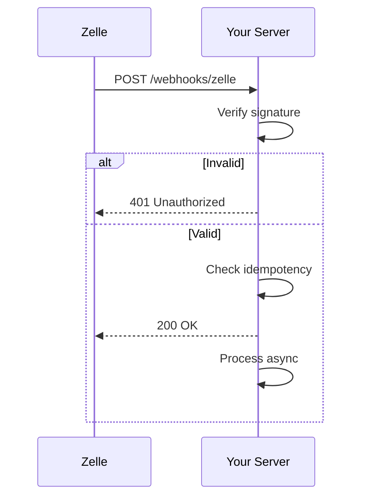

# Zelle Webhook Integration Guide

Receive real-time notifications when payment events occur. Webhooks push events to your endpoint instead of requiring polling.

## How It Works



## Prerequisites

- Zelle account with webhook access enabled
- HTTPS endpoint (TLS 1.2+)
- Webhook signing secret from dashboard

## Endpoint Setup

Your endpoint must:
- Accept `POST` requests at a stable path (e.g., `/webhooks/zelle/v1/events`)
- Verify the `Zelle-Signature` header before processing
- Return `200 OK` within 5 seconds
- Process heavy work asynchronously

## Event Types

| Event | Description |
|-------|-------------|
| `transaction.settled` | Payment completed |
| `transaction.failed` | Payment failed |
| `refund.created` | Refund initiated |
| `chargeback.opened` | Dispute opened |

### Example: transaction.settled

```json
{
  "event_id": "evt_01H7ZZX9P4Y7",
  "event_type": "transaction.settled",
  "created_at": "2026-03-31T23:10:12Z",
  "data": {
    "transaction": {
      "id": "tx_5f3d7a1f-9c2d-4d3f-bf3a-4f8a95d3f9b2",
      "merchant_reference": "order_12345",
      "amount": { "currency": "USD", "value": "150.00" },
      "status": "SETTLED"
    }
  }
}
```

### Example: transaction.failed

```json
{
  "event_id": "evt_01H7ZZX9P4Y8",
  "event_type": "transaction.failed",
  "data": {
    "transaction": {
      "id": "tx_1d4f8e2b-b9fd-4e1c-8f6b-1ad8f9f4e8a7",
      "status": "FAILED",
      "failure_reason": { "code": "FUNDS_NOT_AVAILABLE", "message": "Funds unavailable" }
    }
  }
}
```

## Signature Verification

Zelle signs payloads as: `HMAC_SHA256(secret, timestamp + "." + body)`

### Node.js

```js
import crypto from 'crypto';
import express from 'express';

const SECRET = process.env.ZELLE_WEBHOOK_SECRET;

app.post('/webhooks/zelle', express.raw({ type: 'application/json' }), (req, res) => {
  const sig = req.get('Zelle-Signature') || '';
  const ts = req.get('Zelle-Delivery-Timestamp') || '';

  const expected = crypto
    .createHmac('sha256', SECRET)
    .update(`${ts}.${req.body.toString()}`)
    .digest('hex');

  if (!crypto.timingSafeEqual(Buffer.from(sig), Buffer.from(expected))) {
    return res.status(401).json({ error: 'invalid_signature' });
  }

  const payload = JSON.parse(req.body);
  // TODO: enqueue for async processing

  res.status(200).json({ ok: true });
});
```

### Python (HMAC snippet)

```python
import hmac, hashlib

def verify(secret: bytes, timestamp: str, body: bytes, signature: str) -> bool:
    expected = hmac.new(secret, f"{timestamp}.{body.decode()}".encode(), hashlib.sha256).hexdigest()
    return hmac.compare_digest(signature, expected)
```

## Error Handling

- Return `200`/`204` once event is validated and queued
- Return `401` for invalid signature
- Return `400` for malformed payload
- We retry up to 5 times over 30 minutes with exponential backoff

Deduplicate by `event_id` to ensure idempotent processing.

## Testing

1. Use ngrok or Cloudflare Tunnel for local development
2. Send test events from Zelle dashboard
3. Check delivery logs for failures

## Common Issues

**Signature verification fails**
- Body parser consumed raw body before verification
- Wrong secret (prod vs staging)
- Timestamp in wrong format (seconds vs milliseconds)

**Duplicate processing**
- Missing `event_id` deduplication
- Non-idempotent handlers (use upsert, not insert)

**Events not arriving**
- Endpoint blocked by firewall/WAF
- Not returning 200 within timeout
- Event type not subscribed in dashboard
